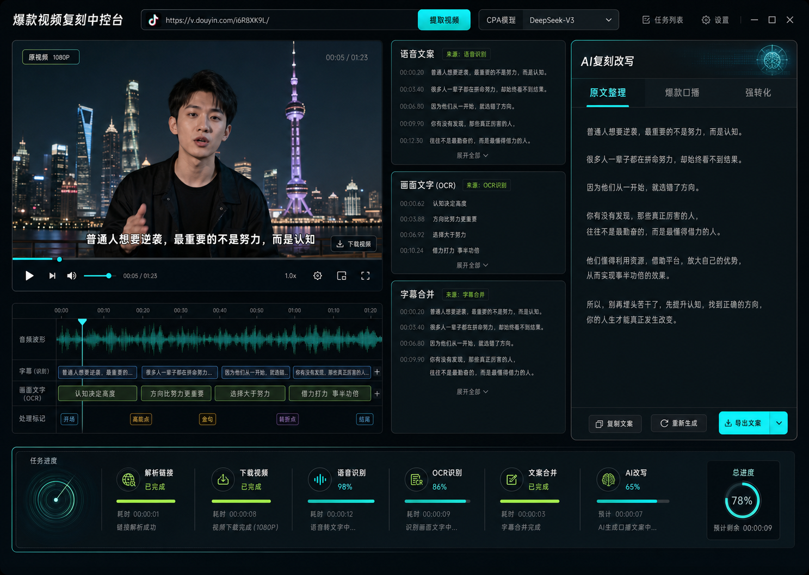
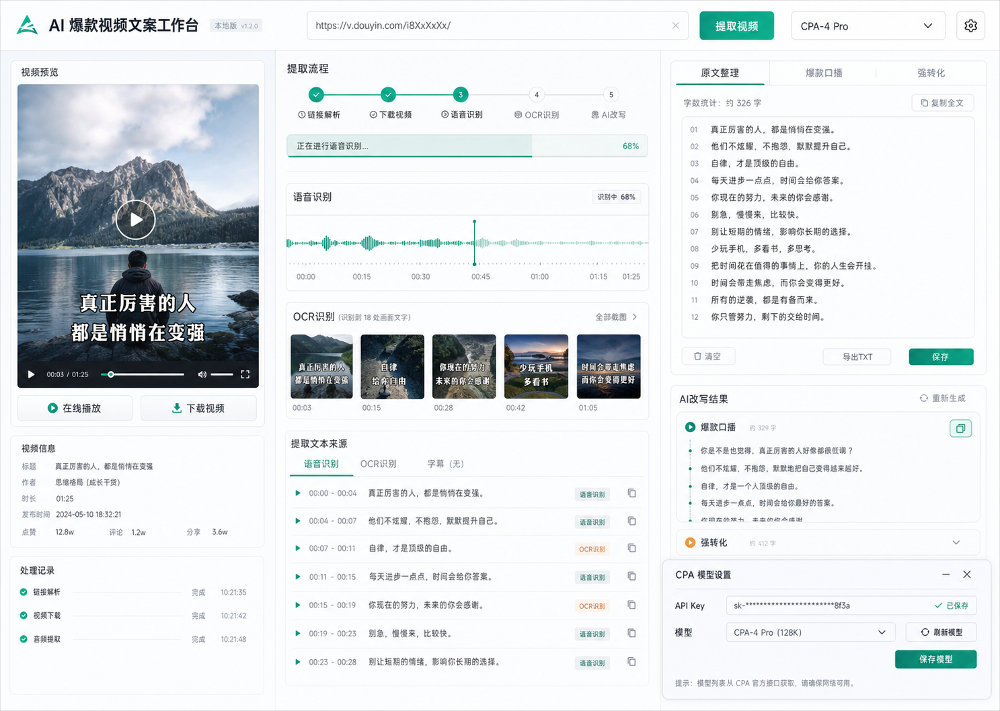
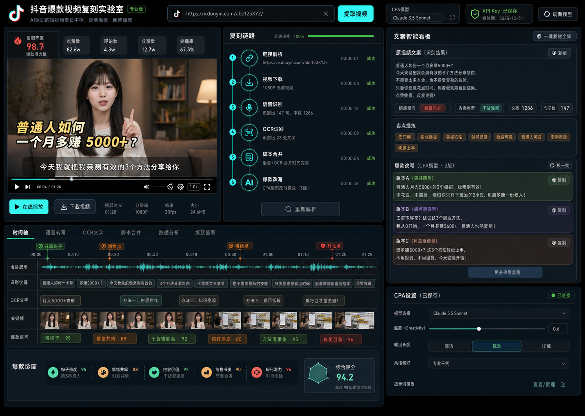

# 抖音爆款视频复刻工具视觉方向

## 目标

页面必须达到商业级交付标准：有美感、炫酷、高科技，并且一打开就能让用户感觉这是一个有价值的 AI 视频分析与文案复刻工具。

本工具不做普通后台风格，也不做简单表单页面。首屏必须直接呈现“视频解析、语音/OCR 识别、爆款文案改写、CPA 模型配置”的完整工作台感。

## 方案 1：霓虹视频中控台

特点：

- 深色高科技视觉，AI 视频情报分析感最强。
- 视频播放器、语音文案、OCR、字幕合并、AI 改写同时可见。
- 底部任务进度条很适合表现解析、下载、识别、改写的流程。

适合：

- 商业演示。
- 强调“AI 视频分析中控台”。
- 做成炫酷大屏感工具。

风险：

- 深色界面对长时间办公略累。
- 如果后续功能越来越多，需要控制信息密度，避免压迫。

## 方案 2：银白 AI 创作工作台

特点：

- 最干净、最稳定、最像成熟 SaaS 产品。
- 识别流程、OCR 帧、文案结果和 CPA 设置都清晰。
- 可读性最好，适合长期使用。

适合：

- 企业工具。
- 长时间办公。
- 后续商业化 SaaS。

风险：

- 炫酷感不如方案 1 和方案 3。
- 对“爆款复刻”的业务情绪表达稍弱。

## 方案 3：短视频作战舱

特点：

- 最贴近“抖音爆款视频复刻”的业务场景。
- 有热视频指标、复刻链路、爆点提炼、时间轴、钩子点、转化点。
- 用户一眼能理解：这不是单纯转文字，而是在拆解爆款、复刻文案。

适合：

- 本项目主方向。
- 对外演示。
- 后续扩展爆款分析、批量复刻、卖点提炼、脚本库。

风险：

- 信息密度最高，开发时必须严格控制层级。
- 不能为了炫酷牺牲核心操作效率。

## 推荐方案

推荐选择 **方案 3：短视频作战舱** 作为主视觉方向，并吸收 **方案 1：霓虹视频中控台** 的高科技动效。

最终开发口径：

- 主结构采用方案 3。
- 视频播放器和识别时间轴吸收方案 1。
- CPA 设置保持方案 2 的简洁清晰。
- 色彩避免过度纯黑和廉价霓虹，使用深色中性底 + 青色信号光 + 少量热度色。
- 首屏必须同时呈现视频、复刻链路、识别结果、AI 改写结果。

## 开发验收标准

- 1440 x 1024 桌面端首屏看起来像商业级 AI 工具。
- 390px 手机宽度不重叠、不横向溢出。
- 用户 3 秒内能看懂工具用途：输入抖音链接，提取视频，识别文案，AI 改写。
- 链接输入、提取按钮、视频播放器、下载按钮、识别原文、改写结果、CPA 模型设置都清楚可见。
- 处理中必须有明显状态反馈，不能点击后无反应。
- 视觉不能像普通后台模板，也不能只是简单 HTML 表单。
